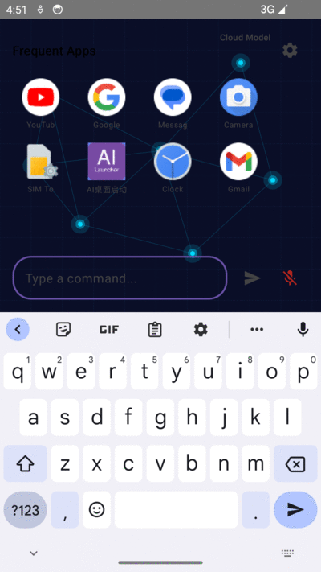

# AI Launcher - スマートデスクトップアシスタント

<div align="center">


**AIでデスクトップ体験を再定義**

[English](README.md) | [中文](README_zh.md) | [日本語](README_ja.md)

</div>

---

## 🌟 プロジェクト紹介

AI Launcherは、先進的な音声認識と自然言語処理技術を統合したAI搭載のAndroidランチャーです。音声コマンドでスマートフォンを操作し、アプリを素早く起動し、よりスマートで効率的なモバイルライフを楽しめます。

### ✨ コアコンセプト

- 🎯 **音声ファースト** - 自然言語でスマートフォンを操作、ハンズフリー
- 🚀 **クイック起動** - 使用習慣を智能に学習、よく使うアプリにワンタップアクセス
- 🎨 **パーソナライゼーション** - 豊富なテーマ、壁紙、レイアウトのカスタマイズオプション
- 🔒 **プライバシー保護** - すべてのデータをローカルに保存、クラウドにアップロードしない

---

## 📺 デモ

<div align="center">
  
</div>

---

## 📱 主な機能

### 🎤 音声コントロール
- 中国語と英語の音声認識に対応
- 自然言語理解、チャットのようにスマートフォンを操作
- 音声でアプリ起動、メッセージ送信、アラーム設定など
- オフライン音声認識（ローカルモデルのダウンロードが必要）

### 📲 スマートアプリ管理
- よく使うアプリを自動学習、デスクトップ上部に表示
- 最大8つのよく使うアプリを表示（2行 × 4列）
- 任意のアプリを素早く検索して起動
- アプリ使用統計とソート

### 🎨 パーソナライゼーション
- **テック背景** - デフォルトのSFスタイルグリッド背景（無効化可能）
- **画像壁紙** - ギャラリーから画像を壁紙として選択
- **グラデーション背景** - 16種類のプリセットグラデーション + カスタムカラー
- **単色背景** - シンプルな単色背景
- **ダークモード** - システムに自動追従または手動切り替え

### ⚙️ 柔軟な設定
- 複数のAIモデルバックエンドをサポート：
  - クラウドモデル（OpenAI、Qwen、DeepSeekなど）
  - ローカルモデル（MLC LLM、完全オフライン）
- カスタムAPIエンドポイントとキー
- 詳細な権限管理
- 豊富な開発者オプション

---

## 🛠️ 技術スタック

### コア技術
- **Kotlin** - 主要開発言語
- **Jetpack Compose** - モダンなUIフレームワーク
- **Material 3** - 最新のMaterial Design仕様
- **Coroutines** - 非同期プログラミング
- **ViewModel** - ライフサイクル対応

### アーキテクチャ
- **MVVMパターン** - 明確な関心の分離
- **Clean Architecture** - 階層化アーキテクチャ設計
- **Repository Pattern** - データアクセスの抽象化

### 依存ライブラリ
- **Retrofit + OkHttp** - ネットワークリクエスト
- **Gson** - JSON解析
- **Coil** - 画像読み込み
- **MLC LLM** - ローカル大規模言語モデル推論

---

## 📥 ダウンロードとインストール

### 方法1：Releasesからダウンロード
[Releasesページ](https://github.com/IceAmber/ai-launcher/releases)から最新のAPKをダウンロード

### 方法2：ソースからビルド
```bash
# リポジトリをクローン
git clone https://github.com/IceAmber/ai-launcher.git
cd ai-launcher

# デバッグバージョンをビルド
./gradlew assembleDebug

# リリースバージョンをビルド
./gradlew assembleRelease

# APKは app/build/outputs/apk/ に配置
```

### 方法3：アプリストア
Google Playなどのアプリストアで近日公開予定、ご期待ください！

---

## 🚀 クイックスタート

### 1. 初回起動
- 必要な権限を付与（アプリリスト、音声認識など）
- テック背景を使用するかどうかを選択（デフォルトで有効）
- AIモデルを設定（オプション）

### 2. AIモデルの設定

#### クラウドモデルを使用（初心者向け）
1. 設定 → モデル設定を開く
2. 「クラウドモデル」を選択
3. APIエンドポイントとキーを入力
   - OpenAI、Qwen、DeepSeek互換APIをサポート
   - 例：`https://api.openai.com/v1`

#### ローカルモデルを使用（完全オフライン）
1. 設定 → モデル設定を開く
2. 「ローカルモデル (MLC)」を選択
3. モデルファイルをダウンロード（初回使用時に必要）
4. ダウンロード完了を待つ

### 3. 音声コントロールを使用
- マイクアイコンをタップするか、ウェイクワードを言う
- コマンドを話します、例えば：
  - 「WeChatを開いて」
  - 「ママに電話して」
  - 「明日の朝7時にアラームを設定」
  - 「今日の天気は？」

---

## ⚙️ 設定

### モデル設定

#### クラウドモデルパラメータ
```kotlin
// サポートされているAPI形式
Base URL: https://api.openai.com/v1
API Key: sk-xxx
Model: gpt-3.5-turbo / gpt-4

// Qwen
Base URL: https://dashscope.aliyuncs.com/api/v1
API Key: sk-xxx
Model: qwen-turbo / qwen-plus

// DeepSeek
Base URL: https://api.deepseek.com/v1
API Key: sk-xxx
Model: deepseek-chat
```

#### ローカルモデル
- デフォルトモデル：gemma-2-2b-it
- モデルサイズ：約1.5GB
- Android 5.0以上、4GB以上のRAMが必要
- 完全オフライン、ネットワーク不要

### 壁紙設定

#### テック背景
- 深い青い背景 (#0A0E27)
- グリッド線（40dp間隔）
- 7つの光るノード + 接続線
- カスタマイズ可能な色と透明度

#### 画像壁紙
- ギャラリーから選択
- ぼかしレベルを調整可能
- 読みやすさ向上のためのオーバーレイ追加
- カスタムオーバーレイ色と透明度

#### グラデーション背景
- 16種類のプリセットグラデーション（サンセット、オーシャン、フォレストなど）
- カスタムの開始色と終了色
- リアルタイムプレビュー

---

## 🧩 権限说明

| 権限 | 用途 | 必須 |
|------|------|------|
| `QUERY_ALL_PACKAGES` | 表示と起動のためのアプリリスト取得 | ✅ 必須 |
| `RECORD_AUDIO` | 音声認識 | ⭕ オプション |
| `INTERNET` | クラウドAIモデルAPIへのアクセス | ⭕ オプション（ローカルモデルでは不要） |
| `VIBRATE` | ハプティックフィードバック | ⭕ オプション |

---

## 🤝 貢献

コードの貢献、問題の報告、改善提案を歓迎します！

---

## 🔒 プライバシーポリシー

私たちはあなたのプライバシーを重視します：

- ✅ **ローカルストレージ** - すべてのデータをデバイスに保存
- ✅ **データ収集なし** - 個人情報を収集しない
- ✅ **クラウドアップロードなし** - 音声認識はローカルで実行（ローカルモデル使用時）
- ✅ **オープンソースの透明性** - コードは完全にオープンソース、監査可能

詳細なプライバシーポリシーについては、[PRIVACY.md](PRIVACY.md)を参照してください

---

## 📄 ライセンス

このプロジェクトは **Apache License 2.0** の下でライセンスされています。

```
Copyright 2026 AI Launcher

Licensed under the Apache License, Version 2.0 (the "License");
you may not use this file except in compliance with the License.
You may obtain a copy of the License at

    http://www.apache.org/licenses/LICENSE-2.0

Unless required by applicable law or agreed to in writing, software
distributed under the License is distributed on an "AS IS" BASIS,
WITHOUT WARRANTIES OR CONDITIONS OF ANY KIND, either express or implied.
See the License for the specific language governing permissions and
limitations under the License.
```

---

## 🙏 謝辞

以下のオープンソースプロジェクトに感謝します：

- [Jetpack Compose](https://developer.android.com/jetpack/compose) - モダンなUIツールキット
- [MLC LLM](https://github.com/mlc-ai/mlc-llm) - ローカル大規模言語モデル推論
- [Coil](https://coil-kt.github.io/coil/) - Kotlin画像読み込みライブラリ
- [Retrofit](https://square.github.io/retrofit/) - 型安全なHTTPクライアント

---

## 📞 連絡先

- 📧 Email: support@ailauncher.app
- 🌐 Website: https://ailauncher.app
- 🐛 Issues: [GitHub Issues](https://github.com/IceAmber/ai-launcher/issues)
- 💬 Discussions: [GitHub Discussions](https://github.com/IceAmber/ai-launcher/discussions)

---

## ⭐ Star履歴

[](https://star-history.com/#IceAmber/ai-launcher)

---

<div align="center">

**このプロジェクトが役に立ったら、⭐ Starを付けてください！**

Made with ❤️ by AI Launcher Team

</div>
